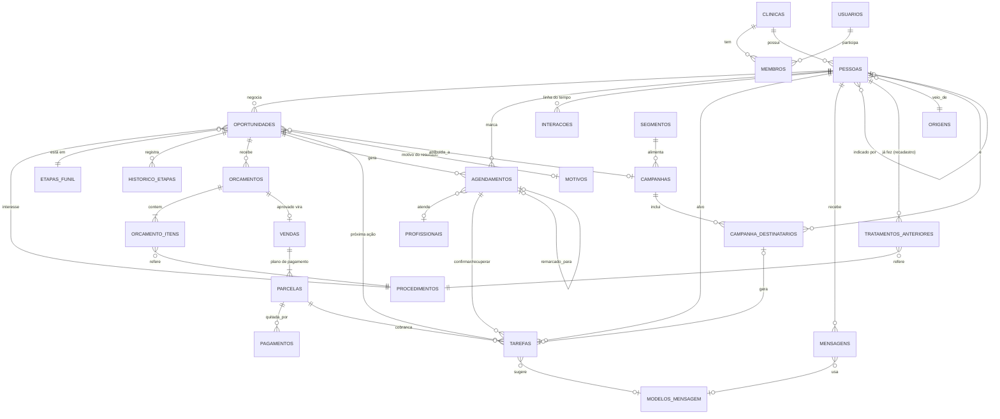
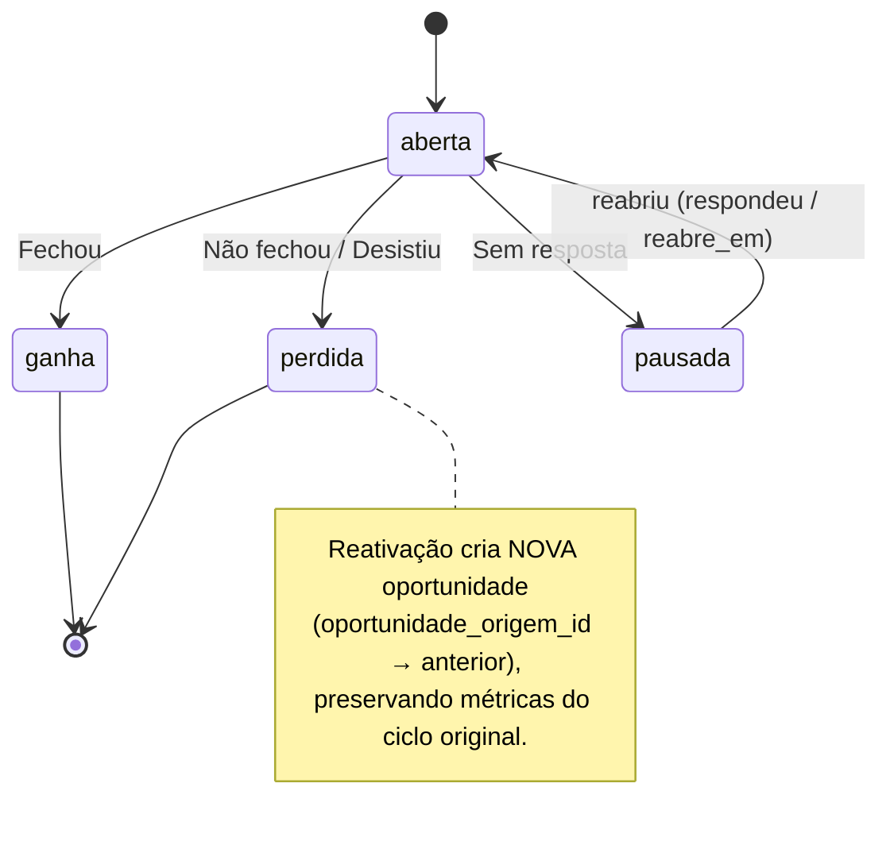

# Instituto CG — CRM comercial · Especificação de arquitetura

> **Status:** proposta para aprovação — nenhum código foi escrito ainda.
> **Data:** 29/09/2026 · **Revisão 2:** tipo de cadastro (novo contato × paciente antigo), recadastramento manual de todos os pacientes, dois usuários.
> **Relação com `PROPOSTA_V1.md`:** este documento incorpora o novo briefing (foco em leads, remarketing, recuperação, reativação e indicadores) e **substitui** a proposta anterior onde houver diferença. As diferenças estão listadas na seção 13.

---

## Sumário

1. [Análise do produto](#1-análise-do-produto)
2. [Arquitetura](#2-arquitetura)
3. [Entidades do banco de dados](#3-entidades-do-banco-de-dados)
4. [Relacionamentos](#4-relacionamentos)
5. [Páginas](#5-páginas)
6. [Fluxos principais de usuário](#6-fluxos-principais-de-usuário)
7. [Regras de negócio](#7-regras-de-negócio)
8. [Sistema de tarefas e lembretes](#8-sistema-de-tarefas-e-lembretes)
9. [Funil comercial](#9-funil-comercial)
10. [Financeiro × pacientes × procedimentos](#10-financeiro--pacientes--procedimentos)
11. [Estrutura para evolução](#11-estrutura-para-evolução)
12. [Indicadores](#12-indicadores)
13. [O que muda em relação à PROPOSTA_V1](#13-o-que-muda-em-relação-à-proposta_v1)
14. [Plano de entrega](#14-plano-de-entrega)
15. [Decisões pendentes](#15-decisões-pendentes)

---

## 1. Análise do produto

### 1.1 O problema real

A clínica já é estabelecida: tem demanda, tem pacientes antigos e tem uma equipe que atende bem. O que se perde **não é o lead — é o acompanhamento**:

- o lead que pediu orçamento pelo Instagram e ninguém retornou no mesmo dia;
- a paciente que "vai pensar" e nunca mais foi procurada;
- quem desmarcou a avaliação e não foi remarcado;
- o paciente que fez clareamento há 14 meses e nunca foi lembrado da manutenção;
- a parcela que venceu e ninguém percebeu.

Cada um desses é **receita que já foi conquistada pelo marketing e se perdeu na operação**. O CRM existe para que isso não aconteça.

### 1.2 Quem usa

| Persona | Perfil | O que precisa |
|---|---|---|
| **Secretária** (usuária diária) | Não conhece CRM; usa WhatsApp o dia todo; fará o recadastramento dos pacientes. | Abrir o sistema e saber **exatamente o que fazer, com quem, e o que dizer**. Registrar o resultado em 1–2 cliques. Cadastrar pacientes antigos em sequência, rapidamente. |
| **Dona da clínica** (administradora) | Decide preços, campanhas, metas; também pode executar tarefas. | Ver se a operação está em dia, quanto está em negociação, quanto entrou e por que as pessoas não fecham. |

Na V1 são **dois usuários**. Os papéis *gestor* e *dentista* continuam previstos no modelo (seção 7.10), mas só serão criados se a equipe crescer.

### 1.3 Princípios de produto (valem para toda decisão)

1. **O sistema pensa, a pessoa executa.** A usuária nunca precisa decidir *quando* fazer o próximo contato — o sistema sugere, ela confirma ou ajusta.
2. **Nenhum lead ou paciente em aberto fica sem próxima ação.** É uma *invariante* do sistema (seção 7.1), não uma boa prática.
3. **Registrar o resultado é o gesto central.** Todo contato termina em "O que aconteceu?" → botões → o sistema cria a próxima ação.
4. **Frases, não números.** "Retornar Maria sobre facetas — orçamento de R$ 14.000 há 8 dias" em vez de "Oportunidade #342 — etapa 5".
5. **Pouco na tela, na ordem certa.** A tela "Hoje" mostra primeiro o que gera mais receita ou tem mais urgência.
6. **Contato com elegância.** Limites de frequência impedem que a clínica pareça insistente — coerente com o posicionamento premium.
7. **Zero dado clínico.** O sistema é comercial e administrativo. Não há onde registrar informação clínica (seção 7.9).

### 1.4 O ciclo central

```
LEAD ENTROU ─► CADASTRO ─► PROCEDIMENTO DE INTERESSE ─► ETAPA DO FUNIL
      ─► PRÓXIMA AÇÃO ─► TAREFA ─► FOLLOW-UP
      ─► RESULTADO: FECHOU | NÃO FECHOU | DESISTIU | SEM RESPOSTA
      ─► PRÓXIMA AÇÃO (tratamento, cobrança, retorno) ou REATIVAÇÃO (futuro)
```

Tradução para o sistema:

| Passo do ciclo | Objeto no sistema |
|---|---|
| Lead entrou / Cadastro | `pessoas` (+ `origem`, `campanha`) |
| Procedimento de interesse | `oportunidades.procedimento_id` (+ interesses secundários) |
| Etapa do funil | `oportunidades.etapa_id` (+ histórico) |
| Próxima ação / Tarefa / Follow-up | `tarefas` (sempre existe uma pendente para oportunidade aberta) |
| Resultado | `oportunidades.resultado` + `motivo` |
| Reativação | segmentos + `campanhas` → geram novas `tarefas` e, quando há interesse, nova `oportunidade` |

### 1.5 Fora do escopo (confirmação)

Não haverá: prontuário, odontograma, diagnóstico, anamnese, evolução clínica, exames, plano clínico detalhado, informações clínicas sensíveis, fotos (antes/depois ou quaisquer), armazenamento de imagens. **Não haverá bucket de arquivos configurado** — nem tecnicamente é possível anexar uma imagem. Também fora: emissão de nota fiscal, contabilidade, estoque, folha.

---

## 2. Arquitetura

### 2.1 Visão geral

```
┌───────────────────────────────────────────────────────────────┐
│ Navegador (desktop, tablet, celular) — PWA responsivo          │
└───────────────────────────────┬───────────────────────────────┘
                                │ HTTPS
┌───────────────────────────────▼───────────────────────────────┐
│ Next.js (App Router) — Vercel, região gru1 (São Paulo)         │
│                                                               │
│  UI (React Server Components + shadcn/ui)                     │
│   │                                                           │
│  Server Actions / Route Handlers  ◄── única porta de escrita   │
│   │                                                           │
│  Camada de domínio (TypeScript puro, testável)                │
│   ├─ módulos: pessoas · crm · agenda · orcamentos · financeiro │
│   │           tarefas · mensagens · remarketing · indicadores  │
│   └─ Motor de Próxima Ação (regras declarativas)              │
│   │                                                           │
│  Repositórios (Drizzle ORM, transações, RLS ativo)            │
│                                                               │
│  Jobs agendados (Vercel Cron → /api/jobs/*, idempotentes)     │
└───────────────────────────────┬───────────────────────────────┘
                                │ Postgres (TLS)
┌───────────────────────────────▼───────────────────────────────┐
│ Supabase — São Paulo                                          │
│  PostgreSQL 16 · Auth (e-mail+senha, 2FA) · RLS por clínica    │
│  Views de indicadores · backups diários (PITR opcional)       │
│  (sem Storage)                                                │
└───────────────────────────────────────────────────────────────┘
```

### 2.2 Decisões técnicas e por quê

| Decisão | Escolha | Justificativa |
|---|---|---|
| Framework | **Next.js 15 + TypeScript** | UI rica, SSR rápido, ecossistema grande, fácil encontrar desenvolvedores. |
| Banco | **PostgreSQL (Supabase)** | Relacional (pessoa → oportunidade → orçamento → parcela), views para indicadores, RLS, servidor no Brasil. |
| Acesso a dados | **Drizzle ORM com conexão direta** | Transações reais: "marcar desmarcou + criar tarefa + registrar evento" é atômico. Cada transação faz `set local role authenticated` e injeta as *claims* do usuário, então **o RLS continua valendo** mesmo no servidor. |
| Regras de negócio | **Em TypeScript, na camada de domínio** | Uma única linguagem para regras síncronas e agendadas; testáveis com Vitest sem banco. |
| Jobs | **Vercel Cron** chamando rotas protegidas por segredo | Mesmas regras em TS; cada execução registrada em `execucoes_job`; idempotente por `chave_dedupe`. |
| UI | **Tailwind + shadcn/ui + Radix** | Componentes acessíveis, fáceis de personalizar para visual premium (não "cara de template"). |
| Agenda | **FullCalendar** (licença MIT) com tema próprio | Dia/semana/lista; arrastar para remarcar. |
| Gráficos | **Recharts** | Leve, suficiente para os indicadores. |
| Validação | **Zod** (compartilhado entre formulário e servidor) | Telefone, moeda, datas. |
| Testes | **Vitest** (domínio) + **Playwright** (fluxos) + testes de RLS em SQL | Os fluxos críticos da seção 6 viram testes E2E. |
| Observabilidade | Sentry (erros) + log estruturado das regras disparadas | Saber *por que* uma tarefa foi criada. |

**Convenções globais:**
- Fuso: `America/Sao_Paulo`; datas de vencimento como `date`, horários como `timestamptz`.
- Dinheiro: **centavos em `bigint`** — nunca `float`.
- Telefones em E.164 (`+5511999999999`).
- IDs `uuid` (`gen_random_uuid()`).
- Toda tabela de negócio tem `clinica_id`, `criado_em`, `atualizado_em`, `criado_por`; exclusão é lógica (`arquivado_em`), salvo pedido LGPD.

### 2.3 Módulos (fronteiras no código)

```
src/
├── app/                        # rotas/páginas (apenas composição de UI)
│   ├── (auth)/login
│   ├── (app)/hoje | agenda | contatos | contatos/[id] | funil | tarefas
│   │        recuperacao | orcamentos | financeiro | indicadores
│   │        mensagens | configuracoes
│   └── api/jobs/* | api/integracoes/*
├── modules/
│   ├── pessoas/        # cadastro, deduplicação, consentimento, situação
│   ├── crm/            # oportunidades, etapas, resultados, motivos
│   ├── agenda/         # agendamentos, status, desmarcações
│   ├── orcamentos/     # orçamentos, itens, aprovação
│   ├── financeiro/     # planos de pagamento, parcelas, pagamentos
│   ├── tarefas/        # tarefas, motor de próxima ação, prioridade
│   ├── mensagens/      # modelos, renderização, provedor de envio
│   ├── remarketing/    # segmentos, campanhas, limites de frequência
│   ├── indicadores/    # consultas agregadas
│   ├── eventos/        # outbox de eventos de domínio
│   └── configuracoes/  # catálogos e parâmetros por clínica
├── components/         # CartaoAcao, RegistrarResultado, LinhaDoTempo…
└── lib/                # db, auth, datas úteis, moeda, telefone
```

Regra de dependência: `app → modules → lib`. Um módulo só fala com outro pela sua interface pública (`modules/x/index.ts`) ou por **eventos** — nunca acessando tabelas alheias diretamente.

### 2.4 Como uma ação percorre o sistema (exemplo)

A operadora clica **"Desmarcou"** no agendamento de João:

1. Server Action `agenda.marcarDesmarcou(agendamentoId, motivo?)`.
2. Abre transação → atualiza `agendamentos.status = 'desmarcado'` → grava `interacoes` (linha do tempo) → grava `eventos` (`agendamento.desmarcado`).
3. O **Motor de Próxima Ação** recebe o evento *na mesma transação* e aplica a regra `R-AG-02`: cria tarefa "Recuperar desmarcação — João (avaliação de implante)", vencimento **hoje**, modelo de mensagem sugerido, prioridade 75.
4. Commit. A tela "Hoje" já mostra o novo cartão.

---

## 3. Entidades do banco de dados

Legenda: 🔑 chave · ➜ FK · *(calc)* calculado em view.

### 3.1 Organização e acesso

**`clinicas`** — o "inquilino" (hoje, uma única linha).
`id🔑, nome, fuso, configuracoes jsonb, plano, criado_em`

**`usuarios`** — perfil vinculado ao `auth.users`.
`id🔑(=auth uid), nome, email, telefone, ativo`

**`membros`** — usuário × clínica × papel.
`id🔑, clinica_id➜, usuario_id➜, papel (admin | gestor | comercial | dentista), pode_ver_financeiro bool, ativo`

**`profissionais`** — quem atende na agenda (pode não ter login).
`id🔑, clinica_id➜, nome, cor, usuario_id➜?, ativo`

### 3.2 Catálogos configuráveis

| Tabela | Campos principais | Exemplos |
|---|---|---|
| `procedimentos` | `nome, categoria, ticket_medio_centavos, ciclo_retorno_meses?, ativo, ordem` | Facetas de porcelana, Lentes de resina, Clareamento, Implante, Alinhadores, Periodontia, Manutenção/limpeza |
| `origens` | `nome, tipo (pago \| organico \| indicacao \| interno), ativo` | Instagram, Google Ads, Site, Indicação de paciente, Indicação de dentista, Passante, Paciente antigo |
| `etapas_funil` | `nome, ordem, tipo (aberta \| ganho \| perda), sla_dias, cor, ativo` | ver seção 9 |
| `motivos` | `nome, aplica_a (nao_fechou \| desistiu \| desmarcou \| encerramento), retorno_sugerido_dias?, ativo` | Valor alto, Precisa pensar, Conversar com família, Forma de pagamento, Escolheu outra clínica, Não é o momento, Medo/insegurança… |
| `modelos_mensagem` | `situacao, titulo, texto (com {variaveis}), canal, ativo` | "Follow-up de orçamento — 7 dias" |
| `regras_parametros` | `codigo_regra, parametros jsonb, ativa` | prazos das cadências (seção 8) |

### 3.3 Núcleo comercial

**`pessoas`** — lead **ou** paciente. É a mesma pessoa em momentos diferentes; não se duplica cadastro quando o lead fecha.
```
id🔑, clinica_id➜
tipo_cadastro (novo_contato | paciente_antigo)  -- escolhido no cadastro (seção 6, F1)
nome, apelido_tratamento?          -- "Dra. Ana", "Sr. Paulo"
telefone_e164 (único por clínica, quando presente), whatsapp_e164?, email?
data_nascimento?  cidade?  bairro?
origem_id➜, campanha_id➜?, indicado_por_pessoa_id➜?, indicado_por_texto?
responsavel_id➜ (membro)
temperatura (fria | morna | quente)           -- definida pela operadora
consentimento_contato bool                    -- pode receber contato ativo
consentimento_marketing bool                  -- pode entrar em campanhas/remarketing
nao_contatar bool + nao_contatar_motivo?      -- bloqueio absoluto
observacoes_comerciais text (≤ 500, com aviso "sem dados clínicos")
paciente_desde?                               -- mês/ano aproximado (paciente antigo)
ultimo_atendimento_informado?                 -- mês/ano informado no recadastro
ultimo_atendimento_precisao (mes | faixa)     -- "mar/2025" ou "entre 1 e 2 anos"
em_tratamento bool                            -- informado no recadastro
primeiro_contato_em, ultimo_contato_em
arquivado_em?
```
*(calc)* `ultimo_atendimento_em` = o mais recente entre `ultimo_atendimento_informado` e o último agendamento `compareceu` registrado no sistema.
*(calc)* `situacao` (view `v_pessoas_situacao`):
- **novo contato** — `tipo_cadastro = novo_contato` e nunca fechou;
- **paciente ativo** — paciente antigo ou já fechou, e (`em_tratamento` ou último atendimento há < N meses);
- **paciente inativo** — paciente antigo ou já fechou, e último atendimento há ≥ N meses (padrão 12).

Um novo contato que fecha passa a ser paciente automaticamente; `tipo_cadastro` guarda como a pessoa **entrou** no sistema (útil para separar indicadores de aquisição dos de reativação).

**`tratamentos_anteriores`** — o que o paciente antigo já fez na clínica, informado no recadastro. Serve para manutenção e reativação (ex.: "clareamento em 2024 → retoque devido").
`id🔑, pessoa_id➜, procedimento_id➜, realizado_em (mês/ano aproximado)?, valor_aproximado_centavos?`
> Apenas o **nome comercial** do procedimento e a data. Sem dentes, materiais, diagnóstico ou qualquer detalhe clínico.

**`oportunidades`** — "um tratamento em negociação". Uma pessoa pode ter várias ao longo do tempo (fechou clareamento em 2025, negocia facetas em 2026).
```
id🔑, clinica_id➜, pessoa_id➜
procedimento_id➜                   -- interesse principal
titulo                             -- "Facetas de porcelana" (editável)
origem_id➜, campanha_id➜?          -- atribuição DESTA oportunidade
etapa_id➜, etapa_desde timestamptz
status (aberta | pausada | ganha | perdida)
resultado? (fechou | nao_fechou | desistiu | sem_resposta)
motivo_id➜?, motivo_detalhe?
valor_estimado_centavos?, valor_fechado_centavos?
responsavel_id➜
reabre_em date?                    -- data acordada para retomar (pausada/perdida)
fechada_em?, aberta_em
oportunidade_origem_id➜?           -- quando nasce de reativação de outra
```

**`oportunidade_interesses`** — procedimentos secundários (N:N). `oportunidade_id➜, procedimento_id➜`

**`historico_etapas`** — cada mudança de etapa (base do "há X dias nesta etapa" e das taxas de conversão).
`oportunidade_id➜, etapa_de➜?, etapa_para➜, mudou_em, mudou_por➜`

**`interacoes`** — linha do tempo da pessoa (todo contato e todo evento relevante).
```
id🔑, clinica_id➜, pessoa_id➜, oportunidade_id➜?, tarefa_id➜?
tipo (contato | nota | etapa | agendamento | orcamento | pagamento | sistema)
canal? (whatsapp | ligacao | instagram | email | presencial)
direcao? (saida | entrada)
resultado? (ver catálogo de resultados, seção 7.3)
resumo text, ocorreu_em, usuario_id➜
```

### 3.4 Agenda comercial

**`agendamentos`**
```
id🔑, clinica_id➜, pessoa_id➜, oportunidade_id➜?, profissional_id➜?
tipo (avaliacao | apresentacao_orcamento | procedimento | retorno | manutencao | ligacao_agendada)
inicio timestamptz, duracao_min
status (agendado | confirmado | compareceu | faltou | desmarcado | cancelado_clinica | remarcado)
desmarcado_em?, motivo_id➜?          -- quando o PACIENTE desmarca
remarcado_para_id➜?                   -- aponta para o novo agendamento (mede recuperação)
confirmado_em?, confirmado_por➜?
observacoes (administrativas)
```
> **Faltou ≠ Desmarcou ≠ Cancelado pela clínica.** São recuperações diferentes, com mensagens e indicadores diferentes.

### 3.5 Orçamentos e financeiro

**`orcamentos`**
```
id🔑, clinica_id➜, pessoa_id➜, oportunidade_id➜
numero (sequencial por clínica), versao
apresentado_em?, valido_ate?
status (rascunho | apresentado | em_negociacao | aprovado | recusado | expirado | substituido)
subtotal_centavos, desconto_centavos, total_centavos
condicao_proposta text                -- "entrada + 10x no cartão"
apresentado_por➜ (profissional)
```

**`orcamento_itens`** — `orcamento_id➜, procedimento_id➜, descricao_comercial, quantidade, valor_unitario_centavos, desconto_centavos`
> `descricao_comercial` é texto de venda ("Lentes de resina — arcada superior"), não plano clínico. Sem dentes, faces, materiais.

**`vendas`** — nasce quando um orçamento é aprovado (1:1 com o orçamento aprovado).
`id🔑, clinica_id➜, pessoa_id➜, oportunidade_id➜?, orcamento_id➜?, tipo (venda | saldo_anterior), fechada_em, total_centavos, forma_pagamento_resumo`
> `saldo_anterior`: usado no recadastro de um paciente antigo que ainda tem parcelas a pagar de um tratamento feito antes do sistema. Não entra no indicador "Vendido" (só em "A receber"/"Recebido").

**`parcelas`** — contas a receber.
```
id🔑, clinica_id➜, venda_id➜, pessoa_id➜
numero (0 = entrada), valor_centavos, vencimento date
forma_prevista (pix | cartao_credito | cartao_debito | boleto | dinheiro | transferencia)
status_manual? (cancelada | renegociada)
```
*(calc)* `valor_pago`, `status` = **paga · parcial · a vencer · vence hoje · atrasada** — derivados dos pagamentos + data (view `v_parcelas`).

**`pagamentos`** — `parcela_id➜, valor_centavos, pago_em, forma, registrado_por➜, observacao`
(Permite pagamento parcial e mais de um pagamento por parcela.)

**`despesas`** *(fora da V1 — decidido: controlar só o que a clínica tem a receber)* — `descricao, categoria, valor_centavos, vencimento, pago_em?` — para quem quiser um resultado simples "entrou × saiu". Sem conciliação bancária.

### 3.6 Tarefas, mensagens e remarketing

**`tarefas`** — ver seção 8 (é a tabela mais importante do sistema).

**`mensagens`** — registro de toda mensagem preparada/enviada.
`id🔑, pessoa_id➜, tarefa_id➜?, modelo_id➜?, canal, provedor (link_wa | api_oficial), texto_final, direcao, status (preparada | aberta | enviada_confirmada | entregue | lida | falhou), id_externo?, usuario_id➜, criado_em`

**`segmentos`** — listas dinâmicas salvas (filtros), ex.: "Não fecharam por valor há 30–90 dias".
`id🔑, nome, descricao, definicao jsonb (filtros validados por Zod), sistema bool`

**`campanhas`** — ação de remarketing/reativação sobre um segmento **ou** campanha de marketing de origem de leads.
```
id🔑, nome, tipo (aquisicao | remarketing | reativacao)
segmento_id➜?, modelo_mensagem_id➜?
inicio, fim?, limite_por_dia int, status (rascunho | ativa | pausada | concluida)
investimento_centavos?              -- para custo por lead / por venda
utm_source?, utm_campaign?          -- para atribuição de leads vindos de anúncios
```

**`campanha_destinatarios`** — `campanha_id➜, pessoa_id➜, tarefa_id➜?, status (na_fila | tarefa_criada | contatado | respondeu | converteu | excluido), motivo_exclusao?`

### 3.7 Infraestrutura

| Tabela | Uso |
|---|---|
| `eventos` | Outbox de eventos de domínio (`lead.criado`, `agendamento.desmarcado`, `orcamento.apresentado`, `venda.fechada`, `parcela.atrasada`…). Base para regras, auditoria de automações e integrações futuras. |
| `execucoes_job` | Cada rodada de job: início, fim, itens processados, erros. |
| `auditoria` | Quem criou/alterou/excluiu/exportou o quê (antes/depois), via trigger genérico. |
| `consentimentos` | Histórico de aceite/revogação (LGPD): tipo, valor, origem, data, usuário. |
| `integracoes` | Credenciais e estado de integrações futuras (criptografadas; vazio na V1). |

---

## 4. Relacionamentos



**Cardinalidades-chave e por quê:**

- **Pessoa 1 : N Oportunidade** — preserva histórico: quem fechou clareamento e depois orça facetas tem duas oportunidades, com origens e resultados próprios. Regra: no máximo **uma oportunidade em andamento (aberta ou pausada) por pessoa** — portanto uma única etapa atual; outros procedimentos da mesma conversa entram como interesses secundários.
- **Oportunidade 1 : N Orçamento** — renegociação gera nova versão (`versao+1`); a anterior fica `substituido`. Só um orçamento `aprovado` por oportunidade.
- **Orçamento 1 : 0..1 Venda 1 : N Parcela 1 : N Pagamento** — separa o que foi **vendido** (competência) do que foi **recebido** (caixa).
- **Tarefa → (pessoa obrigatória) + (oportunidade | agendamento | parcela | campanha opcionais)** — a tarefa sabe "de onde veio" e por isso consegue se auto-cancelar quando o contexto muda (ex.: parcela paga cancela a cobrança).
- **Agendamento → remarcado_para** — encadeia a recuperação e permite medir "quantos desmarcados foram recuperados".

---

## 5. Páginas

Menu lateral com 8 itens principais (o restante fica dentro deles):

| # | Menu | Página | Para que serve | Componentes principais |
|---|---|---|---|---|
| 1 | **Hoje** | `/hoje` | Responder "O que eu tenho que fazer hoje?" | Saudação + frase-resumo; lista de **Cartões de Ação** agrupada; agenda do dia (compacta); 3 números do dia (a contatar, agendados, a receber hoje) |
| 2 | **Agenda** | `/agenda` | Agenda comercial por dia/semana/profissional | Calendário; cores por status; ações rápidas (Confirmar · Compareceu · Faltou · Desmarcou · Remarcar) |
| 3 | **Contatos** | `/contatos` | Leads e pacientes em uma lista só | Busca por nome/telefone; filtros rápidos (Leads · Pacientes ativos · Inativos · Sem próxima ação); botão **+ Cadastrar** (Novo contato · Paciente antigo) |
| | | `/contatos/[id]` | Ficha da pessoa | Cabeçalho (nome, telefone, WhatsApp, situação, temperatura); **Próxima ação** em destaque; Oportunidades; Linha do tempo; Agendamentos; Orçamentos; Parcelas |
| 4 | **Funil** | `/funil` | Visão do pipeline | Quadro kanban por etapa; cartão = nome, procedimento, valor, "há X dias", próxima ação; filtro por procedimento/origem/responsável; totais por coluna |
| 5 | **Tarefas** | `/tarefas` | Todas as tarefas além de hoje | Abas: Atrasadas · Hoje · Próximos 7 dias · Concluídas; filtros por tipo |
| 6 | **Recuperação** | `/recuperacao` | Remarketing e reativação | Segmentos prontos (seção 7.6) com contagem e valor potencial; botão "Criar campanha"; campanhas ativas com progresso |
| 7 | **Financeiro** | `/financeiro` | Controle simples | Cartões: Vendido · Recebido · A receber · Em atraso (no mês); lista de parcelas com filtro; **Registrar pagamento** em 1 clique; previsão 30/60/90 dias |
| | | `/orcamentos` (submenu) | Orçamentos | Lista por status; "parados há mais tempo" primeiro |
| 8 | **Indicadores** | `/indicadores` | Visão gerencial | Seção 12; filtros por período, procedimento, origem, responsável |
| — | Mensagens | `/configuracoes/mensagens` | Biblioteca de modelos | Editor com variáveis e pré-visualização |
| — | Configurações | `/configuracoes/*` | Admin | Usuários, profissionais, procedimentos, origens, motivos, etapas, prazos das regras, limites de contato |

**Componentes transversais (o "vocabulário" da interface):**

- **`CartaoAcao`** — linha da tela Hoje: *verbo + pessoa + contexto + motivo + botões*.
  > **Retornar Maria Souza sobre facetas de porcelana**
  > Orçamento de R$ 14.000 apresentado há 8 dias · 2º follow-up · veio do Instagram
  > `[Abrir WhatsApp com mensagem]` `[Registrar resultado]` `[Adiar ▾]`
- **`RegistrarResultado`** — janela com botões grandes de resultado (seção 7.3) e, em seguida, a **próxima ação sugerida já preenchida** (data + tipo), que a usuária só confirma.
- **`Cadastrar`** — primeiro pergunta **"Quem é?"** com dois botões grandes: **Novo contato** · **Paciente antigo**; cada um abre um formulário curto próprio (fluxos F1a e F1b); aberto de qualquer tela (atalho `N`).
- **`LinhaDoTempo`**, **`SeletorEtapa`**, **`BotaoWhatsApp`**, **`EditorMensagem`**, **`EtiquetaStatus`**, **`ValorMonetario`**.

**Diretrizes visuais (premium, não call center):**
**branco e dourado** (definição da marca; logotipo em produção): fundo branco/marfim, texto grafite, dourado sóbrio como única cor de destaque (botões principais, detalhes, estados ativos) — nunca dourado "metálico" chamativo; os tons ficam em variáveis de tema para serem ajustados quando o logotipo ficar pronto; títulos em serifada elegante (ex.: *Cormorant* / *Fraunces*) e conteúdo em sans legível (ex.: *Inter*); cantos suaves, sombras mínimas, muito espaço em branco; ícones de linha finos (Lucide); sem vermelho gritante — atrasos em âmbar/terracota; microtextos cordiais ("Tudo em dia por aqui ✓"). Nada de ranking, gamificação ou contadores piscando.

---

## 6. Fluxos principais de usuário

### F1 — Cadastro: "Quem é?"
`+ Cadastrar` → **[ Novo contato ]** ou **[ Paciente antigo ]**. Em ambos, o sistema normaliza o telefone e **verifica duplicidade** antes de salvar ("Essa pessoa já está cadastrada. Abrir a ficha?").

#### F1a — Novo contato (meta: < 30 s)
1. Nome, WhatsApp, origem, procedimento de interesse (opcional: observação, temperatura).
2. Cria `pessoa (novo_contato)` + `oportunidade` na etapa **Novo contato** + tarefa **"Fazer primeiro contato"** (vence *agora*, prioridade máxima).
3. Opcional imediato: "Já falou com ela? `[Registrar resultado agora]`".

#### F1b — Paciente antigo (meta: < 45 s; pensado para o recadastramento)
1. **Nome** e **WhatsApp** (obrigatórios).
2. **Último atendimento** — mês/ano, ou, se não lembrar, uma faixa: *menos de 6 meses · 6 a 12 meses · 1 a 2 anos · mais de 2 anos*.
3. **O que já fez?** — botões com os procedimentos do catálogo (opcional; ano aproximado opcional).
4. **Está em tratamento agora?** Sim / Não.
5. **Tem pagamentos em aberto?** Sim → valor restante, nº de parcelas e próximo vencimento (gera `venda saldo_anterior` + parcelas). Não → segue.
6. **Tem interesse em algum tratamento agora?** Sim → escolhe o procedimento → cria oportunidade (origem *Paciente antigo*) com a próxima ação. Não → segue.
7. **Aceita receber mensagens da clínica?** (consentimento).
8. `Salvar` ou **`Salvar e cadastrar o próximo`** (volta ao passo 1 com o formulário limpo).

**O que o sistema faz com um paciente antigo:**
- **Não** cria tarefa de "primeiro contato".
- Calcula a situação (ativo/inativo) pela data do último atendimento.
- Se algum tratamento anterior tem ciclo de retorno vencido (ex.: limpeza > 6 meses), o paciente entra no segmento **Manutenção devida**; se estiver inativo, em **Pacientes antigos** (seção 7.6).
- Essas listas **não viram tarefas automaticamente** durante o recadastramento (ver 7.2).

### F2 — Trabalhar o dia (o fluxo mais usado)
1. Abre **Hoje** → vê cartões ordenados por prioridade.
2. Clica `[Abrir WhatsApp com mensagem]` → modelo já preenchido abre no WhatsApp → envia → volta e confirma "Enviei".
3. Quando houver resposta (ou não), clica `[Registrar resultado]` → escolhe o resultado → o sistema mostra a próxima ação sugerida → `Confirmar`.
4. O cartão sai da lista; o contador "restam X ações" diminui. Ao zerar: "Tudo em dia ✓".

### F3 — Da avaliação ao orçamento
1. Resultado "Agendou avaliação" → escolhe data/horário → agendamento criado; etapa → **Avaliação agendada**; tarefa **"Confirmar avaliação"** na véspera.
2. No dia: `Compareceu` → pergunta "Apresentou orçamento?".
   - **Sim** → cria orçamento (itens + total + condição) → etapa **Orçamento apresentado** → cadência de follow-up iniciada.
   - **Não, vai apresentar depois** → tarefa "Apresentar orçamento" na data informada.

### F4 — Decisão do paciente (os quatro resultados)
| Resultado | O que a usuária informa | O que o sistema faz |
|---|---|---|
| **Fechou** | confirma orçamento aprovado + condição de pagamento (entrada + N parcelas + 1º vencimento) | oportunidade `ganha`; cria `venda` e `parcelas`; cancela tarefas de venda; cria tarefa "Agendar início do tratamento" |
| **Não fechou** | motivo (lista) + "quando falar de novo?" (sugestão pelo motivo) | oportunidade `perdida`; entra no segmento de remarketing do motivo; cria tarefa na data escolhida (ou nenhuma) |
| **Desistiu** | motivo + se aceita contato futuro | oportunidade `perdida/desistiu`; sem tarefa de venda; elegível para reativação após prazo longo (padrão 180 d) se aceitar contato |
| **Sem resposta** | *(automático ao esgotar a cadência, com confirmação humana)* | oportunidade `pausada`; entra em "Sem resposta"; reabre em 60 d com mensagem leve |

### F5 — Paciente desmarcou
1. Na agenda: `Desmarcou` → motivo opcional → "Já remarcou?" **Sim** (escolhe novo horário) / **Não**.
2. Se não: tarefa **"Recuperar desmarcação"** hoje, com mensagem sugerida; cadência D0 → D+2 → D+7.
3. Ao remarcar: novo agendamento ligado a `remarcado_para_id` → conta como **recuperado**.

### F6 — Reativação / remarketing
1. `Recuperação` → escolhe um segmento (ex.: "Pacientes de clareamento há mais de 12 meses") → vê lista e valor potencial.
2. `Criar campanha` → escolhe modelo de mensagem e **limite por dia** (ex.: 8).
3. O sistema cria as tarefas em lotes diários (respeitando limites de frequência e consentimento).
4. Resposta positiva → nova oportunidade (origem "Reativação", ligada à campanha).

### F7 — Financeiro do dia
1. Cartões na Hoje: "Confirmar pagamento previsto para hoje — Ana, parcela 3/10 (R$ 1.200, Pix)".
2. `Registrar pagamento` (valor e forma já preenchidos) → parcela paga → tarefa concluída automaticamente.
3. Parcela não paga até o fim do dia → no dia seguinte vira "Parcela em atraso" com mensagem cordial.

### F8 — Gestora, fim do mês
`Indicadores` → período "Setembro" → leads por origem, conversão por etapa, motivos de perda, vendido × recebido, recuperados e reativados.

---

## 7. Regras de negócio

### 7.1 Invariantes (sempre verdadeiras)

| # | Invariante | Como é garantida |
|---|---|---|
| I1 | **Toda oportunidade `aberta` tem exatamente uma tarefa pendente de "próxima ação".** | Serviço de domínio: não é possível concluir a tarefa de uma oportunidade aberta sem escolher a próxima ação **ou** registrar um resultado final. Job-sentinela diário cria "Definir próxima ação" para qualquer exceção. Índice único parcial impede duas. |
| I2 | Oportunidade `ganha` tem exatamente um orçamento `aprovado` e uma `venda`. | Transação única em `crm.registrarFechamento`. |
| I3 | Oportunidade `perdida` tem `resultado` e `motivo`. | Check constraint. |
| I4 | Pessoa com `nao_contatar = true` não tem tarefas de venda, reativação ou campanha pendentes. | Ao marcar, cancela; regras e segmentos filtram. |
| I5 | Soma dos itens − desconto = total do orçamento; soma das parcelas = total da venda. | Validação no domínio + check na criação. |
| I6 | Valores monetários são inteiros em centavos e ≥ 0. | Tipo + check. |

### 7.2 Cadastro e deduplicação
- Telefone normalizado para E.164; **único por clínica**. E-mail em minúsculas.
- Ao detectar duplicidade: nunca cria segunda pessoa; oferece criar nova oportunidade ou atualizar dados.
- Origem é obrigatória no lead; a **primeira origem** da pessoa não muda (atribuição original); cada oportunidade tem a sua origem (atribuição da venda).
- Indicação: `indicado_por_pessoa_id` permite futuramente agradecer/medir indicações.
- **Tipo de cadastro obrigatório:** todo cadastro começa escolhendo *Novo contato* ou *Paciente antigo*. Se for escolhido errado, a administradora pode corrigir (fica registrado na auditoria).
- **Paciente antigo** recebe origem *Paciente antigo* automaticamente, não entra no funil sem que haja um interesse informado e não conta nos indicadores de aquisição (leads recebidos, conversão de novos contatos).

### 7.2.1 Recadastramento (não há planilha para importar)

Todos os pacientes antigos serão cadastrados à mão. Para isso não virar um peso nem inundar a tela Hoje:
- **Modo recadastramento:** tela de cadastro em sequência (F1b) com contador ("87 pacientes antigos cadastrados") e busca de duplicidade a cada nome.
- **Reativação automática começa desligada.** Enquanto o recadastramento acontece, os pacientes antigos entram nos segmentos (visíveis em *Recuperação*), mas **nenhuma tarefa de reativação é criada**. A administradora liga a reativação quando quiser (Configurações → Reativação), e mesmo assim vale o limite diário (padrão 10/dia).
- **Exceções que geram tarefa imediatamente:** interesse informado no cadastro (vira oportunidade) e parcelas em aberto (cobrança no vencimento).
- Sugestão de rotina: cadastrar os pacientes conforme forem agendando/entrando em contato, e reservar alguns minutos por dia para os demais.

### 7.3 Catálogo de resultados de contato → próxima ação

| Resultado (botão) | Efeito na oportunidade | Próxima ação sugerida |
|---|---|---|
| 💬 Respondeu, com interesse | etapa → Em contato (se estava em Novo contato) | "Conduzir para avaliação" — amanhã |
| 📅 Agendou avaliação | etapa → Avaliação agendada | "Confirmar avaliação" — véspera |
| 🤔 Vai pensar | etapa → Em negociação | Follow-up em 3 dias |
| 🗓️ Pediu retorno em data | mantém etapa | Tarefa na data informada |
| 📵 Não respondeu | mantém etapa; `tentativa+1` | Próxima tentativa da cadência (7.4) |
| ☎️ Número inválido | — | "Buscar outro contato" — hoje; após 2 × → encerra como sem resposta |
| ✅ Fechou | ganha → fluxo F4 | "Agendar início do tratamento" |
| ❌ Não fechou | perdida → motivo | Pelo motivo (7.5) |
| 🚪 Desistiu / sem interesse | perdida (desistiu) | Nenhuma venda; reativação longa se consentir |
| 🚫 Não quer mais contato | `nao_contatar = true` | Nenhuma, jamais |

A próxima ação é **sempre editável** (data e tipo) antes de confirmar.

### 7.4 Cadências padrão (configuráveis em `regras_parametros`)

| Cadência | Passos (dias após o gatilho) | Ao esgotar |
|---|---|---|
| **Primeiro contato** (lead novo) | D0 (SLA: 15 min em horário comercial) → D+1 → D+3 → D+7 | Pergunta humana: pausar como *Sem resposta*? |
| **Follow-up de orçamento** | D+2 (dúvidas) → D+7 → D+15 → D+30 | Pergunta: *continuar (30 d / 90 d)* ou *registrar Não fechou / Sem resposta* |
| **Recuperação de desmarcação** | D0 → D+2 → D+7 | Oportunidade pausada; reativação em 60 d |
| **Recuperação de falta** | D0 → D+1 → D+5 | Idem |
| **Sem resposta (pausada)** | reabre em D+60 com mensagem leve; 2ª tentativa D+120 | Arquiva na oportunidade; pessoa segue elegível a reativação |
| **Cobrança** | D−1 (lembrete opcional) → D0 (confirmar pagamento) → D+1 → D+7 → D+15 | Escala para gestora ("Parcela com 15+ dias de atraso") |

Cadências **nunca** se estendem sozinhas além do último passo: terminam em uma decisão humana.

### 7.5 Motivo de não fechamento → estratégia de retorno

| Motivo | Retorno sugerido | Mensagem sugerida (tom) |
|---|---|---|
| Valor alto | 30 d | condições de pagamento / possibilidade de etapas |
| Forma de pagamento | 15 d | alternativas de parcelamento |
| Precisa pensar / conversar com família | 7 d | "ficou alguma dúvida?" — disponibilidade para nova conversa |
| Medo / insegurança | 10 d | convite para conversa com a dentista |
| Não é o momento | 90 d | contato leve, sem pressão |
| Momento financeiro | 120 d | contato leve |
| Pesquisando outras clínicas | 10 d | diferenciais / autoridade |
| Escolheu outra clínica | 365 d (ou nunca) | — |
| Outro | a definir pela usuária | — |

### 7.6 Remarketing e reativação

**Segmentos prontos (do sistema):**

| Segmento | Critério |
|---|---|
| Orçamentos em aberto | oportunidade aberta, orçamento apresentado há > 7 d, sem contato há > 5 d |
| Não fecharam — recuperáveis | perdida por motivo com retorno sugerido vencido, há ≤ 12 meses |
| Desmarcaram e não remarcaram | agendamento `desmarcado`/`faltou` nos últimos 90 d sem `remarcado_para` |
| Sem resposta | oportunidade `pausada` com `reabre_em` ≤ hoje |
| Manutenção devida | venda de procedimento com `ciclo_retorno_meses` e último atendimento há ≥ ciclo |
| Pacientes antigos | situação *paciente inativo* (último atendimento — informado no recadastro ou registrado na agenda — há ≥ N meses, padrão 12) sem oportunidade aberta |
| Aniversariantes do mês | data de nascimento informada e consentimento de marketing |

**Elegibilidade (vale para todo contato ativo não solicitado):**
1. `consentimento_contato = true` (e `consentimento_marketing = true` para campanhas);
2. `nao_contatar = false`;
3. sem oportunidade aberta **ou** tarefa pendente de outro tipo para a pessoa (evita dois assuntos ao mesmo tempo);
4. **limite de frequência:** nenhum contato ativo nos últimos 3 dias; nenhuma campanha nos últimos 30 dias (configurável);
5. não está em outra campanha ativa.

**Limite diário:** cada campanha tem `limite_por_dia`; reativações automáticas também (padrão 10/dia). O excedente fica na fila, não na tela — a lista de hoje precisa ser *fazível*.

**Remarketing em anúncios (Meta/Google):** V1 exporta CSV de telefones/e-mails de um segmento **somente com `consentimento_marketing`**, registrando a exportação na auditoria. Integração por API fica para V2.

### 7.7 Agenda
- Criar agendamento de `avaliacao` move a oportunidade para **Avaliação agendada** (se estiver antes).
- Confirmação: tarefa na véspera (dia útil anterior: consulta de segunda → confirmação na sexta, pois a clínica não abre aos sábados).
- Conflito de horário do mesmo profissional: aviso (não bloqueio), pois a clínica pode encaixar.
- `compareceu` em avaliação → etapa **Avaliação realizada** + pergunta de orçamento.
- `ligacao_agendada` é agendamento comercial sem profissional (ex.: "ligar para Paula às 18h").

### 7.8 Orçamentos
- Validade padrão configurável (ex.: 30 d); ao expirar vira `expirado`, **sem** encerrar a oportunidade.
- Nova versão substitui a anterior; follow-up continua do passo atual.
- Desconto acima de X% (configurável) exige papel gestor/admin.

### 7.9 Proteção contra dado clínico e LGPD
- Nenhum campo clínico; textos livres têm limite de tamanho e aviso "Não registre informações clínicas".
- Sem upload de arquivos.
- Consentimentos versionados em `consentimentos`; revogação cancela tarefas de campanha na hora.
- Direitos do titular: exportar dados da pessoa (JSON/PDF) e anonimizar (mantendo valores financeiros agregados sem identificação).
- Auditoria de exportações e visualização de financeiro.

### 7.10 Permissões

**V1 — dois usuários:**

| Recurso | Administradora (dona) | Secretária |
|---|:-:|:-:|
| Cadastro, contatos, funil, tarefas, agenda, orçamentos | ✅ | ✅ |
| Registrar pagamentos | ✅ | ✅ |
| Resumo financeiro e indicadores financeiros | ✅ | ✅ |
| Excluir/anonimizar paciente, exportar dados, campanhas | ✅ | ❌ (executa as tarefas das campanhas) |
| Configurações, usuários, auditoria, ligar reativação | ✅ | ❌ |

**Papéis previstos para o futuro** (já suportados pelo modelo, não criados na V1):

| Recurso | Admin | Gestor | Comercial | Dentista |
|---|:-:|:-:|:-:|:-:|
| Contatos, funil, tarefas, agenda | ✅ | ✅ | ✅ | 👁️ + agenda própria |
| Orçamentos | ✅ | ✅ | ✅ | ✅ (os que apresenta) |
| Financeiro | ✅ | ✅ | ⚙️ (flag `pode_ver_financeiro`) | ❌ |
| Indicadores | ✅ | ✅ | resumo próprio | ❌ |
| Campanhas / exportação | ✅ | ✅ | executar tarefas | ❌ |
| Configurações, usuários, auditoria | ✅ | ❌ | ❌ | ❌ |

Aplicado **duas vezes**: na UI (esconde) e no banco via RLS (`clinica_id` do membro + papel).

---

## 8. Sistema de tarefas e lembretes

### 8.1 A tabela `tarefas`

```
id🔑, clinica_id➜, pessoa_id➜ (obrigatório)
oportunidade_id➜?, agendamento_id➜?, parcela_id➜?, campanha_id➜?
tipo            -- primeiro_contato | follow_up_orcamento | confirmar_agendamento
                -- recuperar_desmarcacao | recuperar_falta | reabrir_sem_resposta
                -- retorno_por_motivo | reativacao | manutencao | cobranca
                -- confirmar_pagamento | apresentar_orcamento | agendar_tratamento
                -- definir_proxima_acao | personalizada
categoria       -- vendas | agenda | recuperacao | reativacao | financeiro | outra
titulo          -- "Retornar Maria sobre facetas"
acao_recomendada -- "Pergunte se ficou alguma dúvida sobre o orçamento de R$ 14.000."
modelo_mensagem_id➜?, canal_sugerido
vence_em date, horario? timestamptz        -- horário só quando importa (SLA, ligação agendada)
prioridade int (0–100, recalculada)
passo int, cadencia text                    -- ex.: follow_up_orcamento, passo 2 de 4
status          -- pendente | concluida | cancelada
resultado?      -- do catálogo 7.3
adiamentos int
regra text      -- código da regra que criou (ex.: R-OR-01) ou 'manual'
chave_dedupe text                           -- ex.: "follow_up_orcamento:<oportunidade_id>"
responsavel_id➜
concluida_em?, concluida_por➜?, cancelada_motivo?
```

**Índice único parcial:** `unique (clinica_id, chave_dedupe) where status = 'pendente'` → impossível duplicar lembretes, mesmo que um job rode duas vezes.

### 8.2 Motor de Próxima Ação

Regras declarativas em TypeScript (uma por arquivo, com teste):

```ts
regra({
  codigo: 'R-AG-02',
  quando: 'agendamento.desmarcado',
  se: (ctx) => ctx.pessoa.podeReceberContato && !ctx.agendamento.remarcadoPara,
  entao: (ctx) => criarTarefa({
    tipo: 'recuperar_desmarcacao',
    titulo: `Recuperar desmarcação — ${ctx.pessoa.primeiroNome} (${ctx.agendamento.descricao})`,
    acaoRecomendada: 'Envie uma mensagem acolhedora oferecendo dois novos horários.',
    modelo: 'recuperar_desmarcacao_1',
    vence: hoje(),
    cadencia: 'recuperacao_desmarcacao', passo: 1,
    chave: `recuperar_desmarcacao:${ctx.agendamento.id}`,
  }),
})
```

Três origens de disparo:

| Disparo | Quando | Exemplos |
|---|---|---|
| **Síncrono (evento)** | Na mesma transação da ação do usuário | lead criado, desmarcou, orçamento apresentado, resultado registrado |
| **Job diário** (05:00) | Regras que dependem só do tempo | parcela vence hoje/venceu, orçamento expirou, oportunidade pausada reabre, manutenção devida, pacientes inativos, lotes de campanha, sentinela da invariante I1, recálculo de prioridade |
| **Job horário** (08–20h, dias úteis) | Regras sensíveis ao horário | SLA do lead novo estourado (sobe prioridade e avisa), confirmações do dia seguinte após as 14h |

**Auto-cancelamento:** cada regra declara o que a invalida (ex.: `cobranca` cancela quando a parcela é paga; `confirmar_agendamento` cancela se o agendamento for desmarcado; tudo de venda cancela quando a oportunidade fecha).

### 8.3 Prioridade (ordem da tela Hoje)

```
prioridade = base_do_tipo
           + min(dias_de_atraso × 3, 15)
           + faixa_de_valor (0–10, pelo valor em jogo)
           + temperatura (quente +10, morna +5)
           + horário (vence nas próximas 2 h: +10)
```

| Tipo | Base |
|---|---|
| Primeiro contato (lead novo) | 90 |
| Confirmar agendamento de hoje/amanhã | 85 |
| Confirmar pagamento de hoje | 80 |
| Recuperar desmarcação / falta | 75 |
| Follow-up de orçamento | 65 |
| Retorno por motivo / sem resposta | 50 |
| Manutenção devida | 40 |
| Reativação / campanha | 30 |

### 8.4 Como a tela Hoje é montada

1. Seleciona tarefas `pendente` com `vence_em ≤ hoje` do usuário (ou de todos, para gestora).
2. Agrupa em blocos, nesta ordem:
   **Agora** (vence nas próximas horas / SLA) · **Agenda** (confirmações) · **Vendas** (leads e orçamentos) · **Recuperação** (desmarcou, faltou, não fechou) · **Financeiro** · **Reativação**.
3. Dentro de cada bloco, ordena por `prioridade`.
4. Frase-resumo no topo: *"Bom dia, Ana. Hoje são 14 ações — 3 leads novos, 4 confirmações, 5 follow-ups e 2 pagamentos. R$ 86.400 em orçamentos aguardando decisão."*
5. Atrasadas ficam no mesmo bloco com selo "atrasada há 2 dias" (não somem, não viram outra lista).

### 8.5 Adiar, reatribuir, lembretes

- **Adiar:** `Amanhã` · `3 dias` · `Próxima semana` · `Escolher data`. Conta `adiamentos`; após 3, o cartão sugere "Registrar resultado ou encerrar?".
- **Reatribuir** a outro membro (gestora).
- **Lembretes fora do sistema (V1):** e-mail diário às 07:30 com o resumo do dia (opcional por usuário). Notificação push via PWA fica para V1.1.
- Tarefas **manuais** podem ser criadas de qualquer ficha ("Lembrar de…").

---

## 9. Funil comercial

### 9.1 Etapas (padrão; renomeáveis em Configurações)

| Ordem | Etapa | Tipo | SLA (dias) | Entra quando… | Próxima ação típica |
|---|---|---|---|---|---|
| 1 | **Novo contato** | aberta | 0 | novo contato cadastrado (ou paciente antigo com interesse) | Primeiro contato |
| 2 | **Em contato** | aberta | 3 | houve resposta | Conduzir para avaliação |
| 3 | **Avaliação agendada** | aberta | — | avaliação marcada | Confirmar na véspera |
| 4 | **Avaliação realizada** | aberta | 2 | compareceu | Apresentar orçamento |
| 5 | **Orçamento apresentado** | aberta | 7 | orçamento `apresentado` | Follow-up D+2 / D+7 |
| 6 | **Em negociação** | aberta | 15 | "vai pensar", contraproposta | Follow-up D+15 / D+30 |
| ✅ | **Fechou** | ganho | — | resultado *fechou* | Agendar tratamento · parcelas |
| ❌ | **Não fechou** | perda | — | resultado *não fechou* + motivo | Retorno pelo motivo |
| 🚪 | **Desistiu** | perda | — | resultado *desistiu* | Reativação longa |
| ⏸️ | **Sem resposta** | perda (pausada) | — | cadência esgotada | Reabrir em 60 d |

- O quadro mostra as 6 etapas abertas como colunas; os quatro resultados aparecem como **zonas de soltura** no rodapé (arrastar o cartão para "Fechou" abre o fluxo F4).
- **SLA estourado** = cartão com borda âmbar e selo "parado há 12 dias".
- Mover de etapa **sempre** registra `historico_etapas` e pede/confirma a próxima ação.
- Voltar etapa é permitido (ex.: remarcar avaliação).

### 9.2 Máquina de estados da oportunidade



### 9.3 Métricas do funil derivadas
Conversão etapa → etapa, tempo médio por etapa, valor em cada etapa, taxa de perda por motivo — tudo a partir de `historico_etapas` e `oportunidades` (seção 12).

---

## 10. Financeiro × pacientes × procedimentos

### 10.1 Cadeia

```
Pessoa ─► Oportunidade ─► Orçamento (itens por procedimento)
                               │ aprovado
                               ▼
                             Venda ──► Parcelas ──► Pagamentos
                        (competência)   (a receber)   (caixa)
```

- **Vendido** (competência) = `vendas.total` na data de fechamento.
- **Recebido** (caixa) = soma de `pagamentos` na data de pagamento.
- **A receber** = parcelas não quitadas com vencimento futuro; **Em atraso** = vencidas não quitadas.
- **Por procedimento:** receita atribuída pelos `orcamento_itens` (rateio proporcional quando há desconto global) → ticket médio e faturamento por procedimento.
- **Por origem/campanha:** via `oportunidades.origem_id/campanha_id` → receita por canal, custo por lead e por venda (se `investimento` informado).

### 10.2 Criação das parcelas (no "Fechou")
Formulário único: **Entrada** (valor, data, forma) + **N parcelas** (forma, 1º vencimento, periodicidade mensal). O sistema gera as parcelas, ajustando centavos na última. Editável depois (renegociação: parcelas antigas `renegociada`, novas geradas; histórico preservado).

> Cartão de crédito parcelado pela maquininha: a clínica recebe da operadora, não do paciente. Opção "**Cartão — recebido integralmente**" registra uma parcela única já paga, evitando cobranças indevidas ao paciente.

### 10.3 Regras financeiras
- Pagamento parcial mantém parcela `parcial` e a cobrança pendente pelo saldo.
- Pagar parcela cancela automaticamente as tarefas de cobrança dela.
- Cancelar venda (desistência após fechamento) exige gestor, registra motivo e cancela parcelas futuras; pagamentos já feitos permanecem (estorno é registro manual).
- Tudo que mexe em dinheiro vai para a `auditoria`.

---

## 11. Estrutura para evolução

> ✅ **Interpretação confirmada:** estrutura que permita crescer e evoluir sem reescrever — novas unidades, integrações e, eventualmente, oferecer o sistema como SaaS.

| Direção de crescimento | O que já fica pronto na V1 | O que será feito quando necessário |
|---|---|---|
| **Múltiplas unidades / SaaS** | `clinica_id` em todas as tabelas; RLS por clínica; `membros` com papel por clínica; configurações por clínica; nada "fixo no código" (etapas, motivos, cadências, modelos são dados) | Tela de troca de clínica, cobrança por assinatura, onboarding self-service |
| **WhatsApp oficial (Cloud API)** | Interface `ProvedorMensagem` com implementação `link_wa`; tabela `mensagens` com `provedor`, `id_externo`, status de entrega; modelos com variáveis; telefones E.164; consentimento registrado | Implementar `api_oficial`, webhook de recebimento, aprovação de templates na Meta |
| **Entrada automática de leads** (site, Meta Lead Ads, Google, Instagram) | Rota `POST /api/integracoes/leads` (chave por clínica, idempotência por `id_externo`), mapeamento UTM → `campanhas` | Conectores específicos de cada plataforma |
| **Automação e integrações de saída** | Tabela `eventos` (outbox) com todos os fatos de domínio | Webhooks para n8n/Zapier, e-mail marketing, BI |
| **Pagamentos online** (Pix automático, link de pagamento) | `pagamentos.forma` + `id_externo` previstos | Integração com gateway e baixa automática |
| **Contratos / assinatura digital** | Módulo isolado previsto | Novo módulo `contratos` |
| **App mobile** | PWA responsivo; domínio isolado da UI | App nativo só se houver necessidade real |
| **Escala de dados** | Índices por `(clinica_id, vence_em, status)`, `(clinica_id, etapa_id)`; views de indicadores | Views materializadas / réplica de leitura (irrelevante até dezenas de milhares de pessoas) |
| **Feature flags** | `clinicas.configuracoes.modulos` (ex.: `despesas: false`) | — |

**Módulos clínicos** (prontuário etc.) **não** estão no roadmap. Se um dia forem desejados, exigirão base separada, nova avaliação LGPD (dado sensível de saúde) e não compartilharão tabelas com o CRM.

---

## 12. Indicadores

Implementados como views SQL (`v_ind_*`), filtráveis por período, procedimento, origem, campanha e responsável.

**Comerciais**

| Indicador | Definição |
|---|---|
| Leads recebidos | oportunidades criadas no período (por origem / procedimento) |
| Tempo até 1º contato | mediana entre criação do lead e 1ª interação de saída; % dentro do SLA |
| Taxa de agendamento | leads que chegaram a *Avaliação agendada* ÷ leads |
| Comparecimento | avaliações `compareceu` ÷ avaliações agendadas (desmarcações e faltas separadas) |
| Conversão avaliação → fechamento | fechou ÷ avaliações realizadas |
| Conversão geral | fechou ÷ leads (do período, coorte de criação) |
| Ciclo médio de venda | dias entre criação e fechamento |
| Pipeline | valor total e quantidade em cada etapa aberta |
| Motivos de perda | distribuição de *não fechou* e *desistiu* por motivo |
| Recuperação de desmarcações | desmarcados/faltas remarcados ÷ total |
| Reativação | pessoas reativadas (responderam / nova oportunidade / venda) por campanha |
| Disciplina operacional | % de tarefas concluídas no dia; oportunidades sem próxima ação (deve ser 0) |

**Financeiros**

| Indicador | Definição |
|---|---|
| Vendido | soma das vendas fechadas no período |
| Recebido | soma dos pagamentos no período |
| A receber | parcelas em aberto com vencimento futuro (previsão 30/60/90 d) |
| Em atraso | valor e quantidade de parcelas vencidas; inadimplência % |
| Ticket médio | vendido ÷ número de vendas (geral e por procedimento) |
| Receita por origem/campanha | vendido atribuído; custo por lead e por venda quando houver investimento |

A tela **Hoje** usa só 3 números; a página **Indicadores** concentra o resto — a usuária principal não precisa ver gráficos para trabalhar.

---

## 13. O que muda em relação à PROPOSTA_V1

| Tema | PROPOSTA_V1 | Agora |
|---|---|---|
| Cadastro | `pacientes` | `pessoas` (lead e paciente são a mesma entidade; situação calculada); cadastro começa por **Novo contato × Paciente antigo**, com modo recadastramento |
| Resultado da oportunidade | etapas terminais genéricas | quatro resultados explícitos: **Fechou · Não fechou · Desistiu · Sem resposta**, cada um com próxima ação |
| Próxima ação | campo na oportunidade | **invariante** garantida por serviço + sentinela; tarefas com `acao_recomendada` e prioridade |
| Remarketing | não havia | módulo **Recuperação**: segmentos, campanhas, limites de frequência e consentimento de marketing |
| Agenda | status "cancelado/reagendar" | distinção **faltou × desmarcou × cancelado pela clínica** + encadeamento de remarcação |
| Financeiro | parcelas ligadas ao orçamento | `vendas` → `parcelas` → `pagamentos` (competência × caixa, pagamento parcial) |
| Indicadores | V1.1 | V1 (comerciais e financeiros) |
| Regras agendadas | `pg_cron` em SQL | Vercel Cron chamando o motor em TypeScript (regras em uma só linguagem) |
| Multiempresa | não previsto | `clinica_id` + RLS desde o início |

As demais decisões da PROPOSTA_V1 continuam válidas (stack, hospedagem em São Paulo, custos, LGPD, ausência de Storage, integração WhatsApp via link na V1).

---

## 14. Plano de entrega

Cada etapa termina com algo testável em ambiente de homologação com dados fictícios.

| Etapa | Entrega |
|---|---|
| 0. Fundação | Projeto, Supabase SP, login, membros/papéis, RLS, auditoria, layout e identidade visual, seed fictício |
| 1. Cadastro | "Quem é?" (novo contato × paciente antigo), **modo recadastramento**, tratamentos anteriores, saldo anterior, deduplicação, ficha, linha do tempo, botão WhatsApp — **entregue primeiro para o recadastramento começar cedo** |
| 2. Motor de tarefas + Hoje | Tabela de tarefas, regras síncronas, *Registrar resultado*, prioridade, tela Hoje |
| 3. Funil | Oportunidades, etapas, kanban, histórico, quatro resultados, motivos |
| 4. Agenda | Agendamentos, confirmações, faltou/desmarcou/recuperação |
| 5. Orçamentos | Itens, versões, cadência de follow-up |
| 6. Financeiro | Vendas, parcelas, pagamentos, cobrança |
| 7. Jobs | Cron diário/horário, sentinela, expirações, manutenção, reativação automática |
| 8. Recuperação | Segmentos, campanhas, limites, exportação com consentimento |
| 9. Indicadores | Views + página de indicadores |
| 10. Produção | Planos pagos, backup testado, domínio, revisão de segurança, LGPD, treinamento |

---

## 14.1 Banco de dados implementado

Arquivos em `supabase/migrations/` (detalhes e testes em `supabase/README.md`). Ajustes em relação ao texto acima, decididos na implementação:

- **Uma negociação em andamento por pessoa** (índice único), garantindo uma única etapa atual; o histórico de etapas guarda etapa anterior, nova, data, usuário e observação.
- **Status e resultado da oportunidade derivam da etapa** (gatilho): mover a etapa é a única forma de mudar o estado.
- **Regras que nunca podem falhar ficam no banco** (gatilhos), valendo para qualquer caminho de escrita: lembrete financeiro por parcela, histórico de etapas, follow-ups automáticos da agenda, último contato, auditoria. As regras de cadência (quando fazer o próximo follow-up) continuam na camada TypeScript.
- **Formas de pagamento configuráveis** (`formas_pagamento`) + condição **à vista / parcelado**.
- **Follow-ups imutáveis:** só podem ser anulados com motivo; pagamentos só estornados; contatos arquivados; nada é apagado.

## 15. Decisões pendentes

**Decidido:**
- Item 11 confirmado (estrutura para crescer sem reescrever).
- Dois usuários: dona (administradora) e secretária — **a secretária vê o resumo financeiro**.
- Não há planilha: recadastro manual; cadastro separa *Novo contato* de *Paciente antigo*; termo "Novo contato" na interface.
- Agenda: **uma profissional** (a dona da clínica); funcionamento **segunda a sexta, 08h–19h**; fechado sábado e domingo.
- Financeiro: **só contas a receber** na V1 (sem despesas).
- Visual: **branco e dourado**; logotipo em produção (espaço reservado até lá).
- Prazos adotados como padrão, ajustáveis em Configurações: primeiro contato em até 15 min no horário comercial; paciente inativo após 12 meses; reativação de quem desistiu após 180 dias; no máximo 1 contato ativo a cada 3 dias e 1 campanha a cada 30 dias por pessoa.

**Ainda em aberto (não bloqueia o início):**
1. E-mails de acesso de cada usuária (necessários só ao criar os logins).
2. Feriados em que a clínica fecha (o sistema já considera os feriados nacionais).
3. Arquivo do logotipo, quando pronto.
