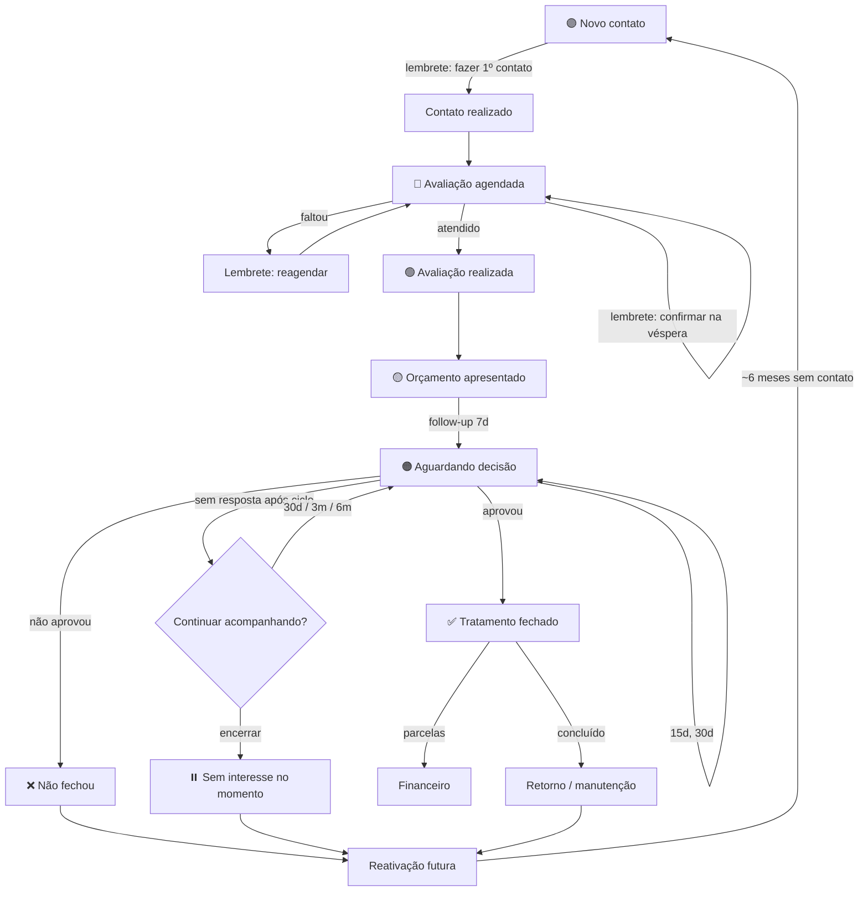

# Instituto CG — CRM interno · Proposta de arquitetura da V1

> Documento para revisão e aprovação. **Nenhum código, banco de dados ou serviço foi criado ainda.**
> Data: 29/09/2026
>
> ⚠️ **Atualizado por [`ARQUITETURA_CRM.md`](./ARQUITETURA_CRM.md)**, que incorpora o briefing com foco em leads, remarketing, recuperação e indicadores. Onde houver diferença, vale o documento novo.

---

## 0. Pontos que precisam da sua decisão antes de começar

Você enviou dois briefings. O segundo é mais recente e mais restritivo, então **usei o segundo como regra** e o primeiro como complemento. Onde eles se contradizem, fiz uma recomendação:

| # | Conflito / dúvida | Minha recomendação |
|---|---|---|
| 1 | O 1º briefing pedia **Casos clínicos (antes/depois)**; o 2º proíbe fotos e dados clínicos. | **Fora do sistema.** Nenhuma foto de paciente será armazenada. |
| 2 | O 1º pedia **Biblioteca de materiais** (receitas, orientações, vídeos). O 2º não menciona. Receitas e orientações pós-procedimento se aproximam de conteúdo clínico. | **Fora da V1.** Na V1 entra apenas a **Biblioteca de mensagens** (textos para WhatsApp). Uma biblioteca de arquivos *genéricos* (não vinculados a paciente) pode entrar na V2. |
| 3 | Etapas do funil diferentes (8 no 1º, 9 no 2º). | Usar as **9 etapas** do 2º briefing (inclui "Contato realizado"). |
| 4 | Status de orçamento diferentes. | Unificar em: **Rascunho · Apresentado · Aguardando decisão · Aprovado · Não aprovado · Expirado**. ("Paciente pensando" = Aguardando decisão.) |
| 5 | Um paciente pode ter **mais de um interesse ao longo do tempo** (ex.: fechou clareamento, depois orçou lentes). Se a etapa do funil ficar "no paciente", o histórico se perde. | Criar o conceito de **Oportunidade** (= "um tratamento em negociação"). A etapa do funil pertence à oportunidade. Na tela, a equipe vê simplesmente "Maria — Lentes de resina — Aguardando decisão". Na maioria dos casos o paciente terá uma só. |
| 6 | "Ao marcar como atendido, registrar o que aconteceu" pode virar anotação clínica. | O registro pós-consulta será **apenas comercial**: *"Apresentou orçamento? Qual o próximo passo?"* — sem campo de texto clínico. O campo de observações terá um aviso: "Não registre informações clínicas aqui". |
| 7 | Data de nascimento: útil (mensagem de aniversário) mas é dado pessoal. | **Opcional.** Pela LGPD, só coletar o necessário. |
| 8 | Financeiro: "atrasado" exige saber vencimentos. | Usar **parcelas com vencimento**, mas o cadastro será "Entrada + N parcelas a partir de tal data" (o sistema gera as parcelas sozinho). |
| 9 | Hospedagem gratuita vs. paga. | Para dados reais, **usar planos pagos** (backup diário e uso comercial permitido). Custo estimado na seção E. |
| 10 | Quem são os "profissionais" da agenda? | Cadastro separado de "Profissionais" (não precisa ter login). Confirme quantos dentistas atendem hoje. |

**Perguntas rápidas para você responder:**
1. Quantas pessoas vão usar o sistema (logins)? Quem pode ver valores financeiros?
2. Quantos profissionais atendem na agenda? Há mais de uma cadeira/sala?
3. Horário de funcionamento da clínica e duração padrão de uma avaliação.
4. Vocês têm hoje uma planilha de pacientes que precisará ser importada? (Se sim, a importação vira uma etapa própria.)
5. O domínio desejado (ex.: `sistema.institutocg.com.br`).

---

## A. Entendimento do produto

É um **CRM de relacionamento e organização comercial** para uma clínica odontológica premium — **não é um prontuário**.

Ele acompanha cada paciente desde o **primeiro contato** até o **fechamento do tratamento**, o **pagamento** e o **retorno futuro**, e — o mais importante — **diz à equipe o que fazer a cada dia**.

O princípio central:

> **Todo registro gera um próximo passo.** Nenhum paciente fica "perdido" porque ninguém lembrou de entrar em contato.

A tela principal responde à pergunta **"O que precisa ser feito hoje?"** com frases de ação, não com números soltos:

> *Hoje você precisa falar com 4 pacientes, confirmar 3 avaliações e acompanhar 2 orçamentos.*
> *Maria Silva está aguardando decisão há 12 dias — orçamento de R$ 8.500 (Lentes de resina). Entrar em contato hoje.*

As mensagens de WhatsApp são **sugeridas** pelo sistema, **editadas e enviadas por uma pessoa**, e o resultado é registrado. Nada é enviado automaticamente.

---

## B. O que entra na V1

1. **Hoje (Dashboard)** — "O que precisa ser feito hoje", agenda do dia, resumo do funil e do financeiro.
2. **Pacientes** — cadastro simples, página do paciente com linha do tempo.
3. **Primeiro contato** — cadastro rápido com origem e procedimento de interesse.
4. **CRM / Funil** — quadro visual (colunas) com as 9 etapas; avançar/voltar arrastando ou com um clique.
5. **Agenda** — dia, semana e mês; status com cores; ações automáticas para falta e atendimento.
6. **Orçamentos** — valor, desconto, condição de pagamento, status; fluxo guiado de "não fechou" (motivo + quando voltar a falar).
7. **Follow-ups e lembretes** — criados automaticamente, com ciclo 7 → 15 → 30 dias e limite (nunca infinito).
8. **Reativação** — pacientes sem contato há X meses (padrão 6, configurável), inclusive antigos.
9. **Retornos pós-tratamento** — "Relembrar este paciente daqui a 6 meses", manutenção, revisão.
10. **Mensagens de WhatsApp** — biblioteca de modelos editáveis, botão para copiar e abrir o WhatsApp, registro do contato.
11. **Financeiro simples** — parcelas, recebido / a receber / em atraso, lembrete de parcela atrasada.
12. **Configurações** — usuários, profissionais, procedimentos, origens, motivos, prazos de follow-up e reativação.
13. **Segurança** — login, perfis de acesso, histórico de alterações (auditoria), backups.

**V1.1 (logo após):** Relatórios simples (contatos por origem, taxa de fechamento, motivos de perda, valores) com filtros por mês, procedimento e origem. Sem rankings nem gamificação.

---

## C. O que fica fora (confirmação explícita)

O sistema **NÃO** terá, nem na V1 nem como "campo escondido":

- ❌ Prontuário odontológico ou clínico
- ❌ Anamnese, evolução clínica, diagnóstico
- ❌ Odontograma
- ❌ Resultados de exames
- ❌ Plano de tratamento clínico detalhado
- ❌ **Fotos de pacientes, fotos de antes e depois, qualquer imagem clínica**
- ❌ Biblioteca de casos clínicos
- ❌ Envio automático de WhatsApp / integração com API oficial
- ❌ Financeiro contábil, nota fiscal, estoque, folha de pagamento

Também **não** configuraremos armazenamento de arquivos (Storage) na V1 — assim, não há nem a possibilidade técnica de subir uma foto de paciente.

A arquitetura continua **modular**, então esses itens *poderiam* ser adicionados no futuro como módulos separados, se um dia vocês decidirem — mas isso exigiria uma nova análise de segurança (dado de saúde é "dado sensível" na LGPD).

---

## D. Arquitetura sugerida (em linguagem simples)

```
┌─────────────────────────────┐
│  Navegador (computador,     │   A equipe acessa por um endereço na internet,
│  tablet ou celular)         │   como um site. Não precisa instalar nada.
└──────────────┬──────────────┘
               │ conexão segura (HTTPS)
┌──────────────▼──────────────┐
│  Aplicação web (Next.js)    │   As telas + as "regras do negócio"
│  hospedada na Vercel        │   (ex.: "se faltou, crie um lembrete").
└──────────────┬──────────────┘
               │
┌──────────────▼──────────────┐
│  Supabase (servidor em      │   • Banco de dados PostgreSQL
│  São Paulo)                 │   • Login e senhas (Auth)
│                             │   • Regras de acesso por usuário (RLS)
│                             │   • Tarefa diária automática (pg_cron)
│                             │   • Backup diário
└─────────────────────────────┘
```

**Como o sistema "lembra" das coisas — dois mecanismos:**

1. **Na hora da ação:** quando alguém marca "faltou", "não fechou", "atendido" etc., o próprio sistema cria o próximo lembrete na mesma operação.
2. **Rotina diária (toda madrugada):** um processo automático no banco verifica o que depende só da passagem do tempo — pacientes há 6 meses sem contato, parcelas que venceram, orçamentos que expiraram, confirmações de consultas de amanhã — e cria os lembretes.

**Organização em módulos** (cada um é uma "gaveta" independente no código):

```
pacientes · crm (oportunidades) · agenda · orcamentos · financeiro
tarefas (follow-ups/lembretes) · mensagens · configuracoes · auditoria
```

Módulos futuros (prontuário, contratos, assinatura digital, WhatsApp oficial, pagamentos online) entram como novas gavetas, sem reescrever as existentes.

---

## E. Stack tecnológica

Avaliei a sugestão (Next.js + Supabase + Vercel) contra alternativas:

| Opção | Prós | Contras | Veredito |
|---|---|---|---|
| **Next.js + Supabase + Vercel** | Moderna, muito usada, ótima para interfaces bonitas; banco relacional real (PostgreSQL); login e regras de acesso prontos; servidor no Brasil; baixo custo; fácil encontrar desenvolvedores no futuro. | Dois fornecedores; exige cuidado para configurar as regras de acesso corretamente (faremos desde o início). | ✅ **Recomendada** |
| Laravel / Rails (servidor tradicional) | Tudo em um só lugar; muito maduro. | Precisa de servidor próprio para manter, atualizar e fazer backup — mais trabalho de manutenção para vocês. | Boa, mas mais manutenção |
| Firebase (Google) | Simples para começar. | Banco não-relacional: relatórios e relações (paciente → orçamento → parcelas) ficam difíceis. | ❌ |
| No-code (Bubble, Glide etc.) | Rápido para protótipo. | Fica "preso" à ferramenta, custo cresce, segurança e LGPD limitadas, difícil evoluir. | ❌ |

**A stack escolhida, peça por peça:**

| Tecnologia | Para que serve (em uma frase) |
|---|---|
| **Next.js** (React) | Monta as telas e roda as regras do sistema no servidor. |
| **TypeScript** | "Corretor ortográfico" do código: evita muitos erros antes de chegarem à tela. |
| **Tailwind CSS + shadcn/ui** | Visual limpo e consistente, com componentes elegantes e acessíveis prontos. |
| **Supabase — PostgreSQL** | O banco de dados, onde tudo fica guardado de forma organizada e relacionada. |
| **Supabase Auth** | Login com e-mail e senha (com possibilidade de verificação em duas etapas). |
| **Row Level Security (RLS)** | Regras no próprio banco que impedem que alguém veja o que não deve, mesmo se houver um erro na tela. |
| **pg_cron** | O "despertador" diário que gera lembretes dependentes do tempo. |
| **Zod** | Confere se os dados digitados são válidos (telefone, valores, datas). |
| **FullCalendar** (ou agenda própria) | Visual de agenda dia/semana/mês. |
| **GitHub** | Guarda o código e todo o histórico de mudanças. |
| **Vercel** | Publica o sistema na internet, com HTTPS, na região de São Paulo. |
| **Playwright + Vitest** | Testes automáticos dos fluxos principais (não quebrar o que funciona). |

**Custo mensal estimado (produção com dados reais):**
- Supabase **Pro**: ~US$ 25/mês — necessário para backup diário automático e para o banco não "hibernar".
- Vercel **Pro**: ~US$ 20/mês — o plano gratuito não permite uso comercial.
- Domínio: ~R$ 40/ano.
- **Total ≈ US$ 45/mês (~R$ 250).** Durante o desenvolvimento (só com dados fictícios) podemos usar os planos gratuitos.

**Fuso horário:** todo o sistema operará em `America/Sao_Paulo`. Valores em R$ serão guardados em centavos (número inteiro) para nunca haver erro de arredondamento.

---

## F. Estrutura de páginas (telas)

Menu lateral com **poucos itens** e ícones claros:

| Menu | Tela | O que faz |
|---|---|---|
| 🏠 **Hoje** | Dashboard | "O que precisa ser feito hoje" (lista de ações com botões), agenda do dia, resumo do funil e do financeiro. |
| 📅 **Agenda** | Dia / Semana / Mês | Agendamentos coloridos por status; clique para criar/editar; ações rápidas (confirmar, atendido, faltou). |
| 👥 **Pacientes** | Lista + busca | Busca por nome/telefone; filtros por etapa e origem. |
| | Página do paciente | Contato, botão WhatsApp, etapa atual, **próxima ação**, linha do tempo, orçamentos, agendamentos, parcelas. |
| | Novo contato | Formulário curto (nome, WhatsApp, origem, interesse) — 30 segundos. |
| 🎯 **Funil** | Quadro (colunas) | As 9 etapas em colunas; cada cartão mostra paciente, procedimento, valor e "há X dias nesta etapa". |
| 🔔 **Follow-ups** | Lista de tarefas | Abas: Hoje · Atrasados · Próximos · Reativação. Cada item com [WhatsApp] [Registrar contato] [Adiar] [Encerrar]. |
| 📄 **Orçamentos** | Lista + criar | Filtro por status; orçamentos parados há mais tempo aparecem primeiro. |
| 💰 **Financeiro** | Resumo + parcelas | Recebido / A receber / Em atraso no período; lista de parcelas; registrar pagamento com um clique. |
| 💬 **Mensagens** | Biblioteca de modelos | Modelos editáveis por situação, com variáveis (nome, procedimento…). |
| ⚙️ **Configurações** | (admin) | Usuários e permissões, profissionais, procedimentos, origens, motivos, prazos de follow-up e reativação. |
| — | Login / Esqueci a senha | |

**Janelas guiadas (em vez de formulários longos):**
- "Paciente não fechou" → 1) Por quê? (múltipla escolha) 2) Quando falar de novo? 3) Quer ver a mensagem sugerida?
- "Paciente faltou" → Criar lembrete para reagendar? [Sim, hoje] [Sim, amanhã] [Não]
- "Consulta realizada" → Apresentou orçamento? [Sim → abre orçamento] [Não → próximo passo]
- "Registrar contato" → Resultado: respondeu / não respondeu / vai pensar / agendou / sem interesse
- "Tratamento concluído" → Relembrar em: [3 meses] [6 meses] [1 ano] [data] [não]

---

## Fluxo do paciente



---

## G. Modelo de dados

### Entidades e relações

```
usuarios (login) ─┐
                  ├─ responsável por → pacientes, oportunidades, tarefas
profissionais ────┴─ atende → agendamentos

pacientes 1 ──── N oportunidades (tratamento em negociação; guarda a etapa do funil)
pacientes 1 ──── N agendamentos
pacientes 1 ──── N orcamentos ──── N parcelas (financeiro)
pacientes 1 ──── N tarefas (follow-ups, lembretes, reativação)
pacientes 1 ──── N interacoes (linha do tempo: contatos, mudanças, eventos)
pacientes 1 ──── N mensagens (registro do que foi preparado/enviado)

oportunidades 1 ─ N orcamentos / agendamentos / tarefas
orcamentos N ──── N motivos_nao_fechamento
modelos_mensagem ─ usados por → mensagens
auditoria ─ registra alterações importantes em qualquer tabela
```

### Campos principais

**usuarios** (perfil ligado ao login)
`nome, email, papel (admin | dentista | secretaria), ativo`

**profissionais**
`nome, cor_na_agenda, ativo, usuario_id (opcional)`

**pacientes**
`nome, telefone, whatsapp, email, data_nascimento (opcional), cidade, origem, indicado_por (texto, opcional), responsavel_id, observacoes_comerciais, aceita_contato (LGPD), criado_em, ultimo_contato_em, arquivado_em`

**oportunidades** *(o "cartão" do funil)*
`paciente_id, procedimento_interesse_id, origem, etapa, etapa_desde, responsavel_id, valor_estimado, proxima_acao, proxima_acao_em, encerrada_em, motivo_encerramento`

**procedimentos** (catálogo configurável)
`nome, categoria, retorno_padrao_meses (ex.: limpeza = 6), ativo`
→ Lentes de resina, Facetas de porcelana, Clareamento, Periodontia, Implante, Restaurações, Outros

**agendamentos**
`paciente_id, oportunidade_id?, profissional_id, tipo (avaliação | procedimento | retorno | manutenção), procedimento_id?, inicio, duracao_min, status (agendado | confirmado | realizado | faltou | cancelado | reagendar), observacoes`

**orcamentos**
`paciente_id, oportunidade_id, data, procedimento(s), valor_total, desconto, valor_final, forma_pagamento, entrada, num_parcelas, primeiro_vencimento, status, valido_ate, retorno_previsto_em, observacoes`

**orcamento_motivos** — N:N com o catálogo `motivos_nao_fechamento`
→ Valor alto · Precisa pensar · Conversar com família · Pesquisando outras clínicas · Não é o momento · Medo/insegurança · Forma de pagamento · Momento financeiro · Escolheu outro local · Não respondeu · Outro

**parcelas** (financeiro)
`orcamento_id, paciente_id, numero (0 = entrada), valor, vencimento, valor_pago, pago_em, forma_pagamento, status (calculado: pago | parcial | a receber | em atraso)`

**tarefas** *(o coração do "o que fazer hoje")*
`paciente_id, oportunidade_id?, orcamento_id?, agendamento_id?, parcela_id?, tipo, titulo, vence_em, responsavel_id, status (pendente | concluída | adiada | cancelada), passo_do_ciclo (1, 2, 3…), resultado, concluida_em, concluida_por, origem_automatica (qual regra criou)`

Tipos: `primeiro_contato · confirmar_agendamento · reagendar_falta · follow_up_orcamento · reativacao · retorno_manutencao · cobranca · personalizado`

**interacoes** (linha do tempo)
`paciente_id, tipo (contato | etapa_alterada | agendamento | orçamento | pagamento | nota), canal (WhatsApp, telefone, presencial, Instagram…), resultado, descricao, usuario_id, ocorreu_em`

**modelos_mensagem**
`situacao, titulo, texto (com {primeiro_nome}, {procedimento}, {data}, {horario}), ativo`

**mensagens** (preparado para integração futura)
`paciente_id, tarefa_id?, modelo_id?, canal ('whatsapp_link' hoje; 'whatsapp_api' no futuro), texto_final, direcao (saída/entrada), status (preparada | aberta_no_whatsapp | confirmada_pela_equipe), provedor, id_externo, usuario_id, criado_em`

**configuracoes**
`meses_reativacao = 6, ciclo_follow_up = [7, 15, 30], dias_validade_orcamento, horario_clinica, duracao_padrao_avaliacao`

**auditoria**
`tabela, registro_id, acao (criou | alterou | excluiu | exportou), antes, depois, usuario_id, quando`

### Permissões (sugestão inicial — simples)

| Ação | Admin | Dentista | Secretária |
|---|:-:|:-:|:-:|
| Pacientes, agenda, funil, follow-ups | ✅ | ✅ | ✅ |
| Orçamentos | ✅ | ✅ | ✅ |
| Financeiro (valores e parcelas) | ✅ | ✅ | ✅ *(configurável)* |
| Excluir paciente / exportar dados | ✅ | ✅ | ❌ |
| Usuários, configurações, auditoria | ✅ | ❌ | ❌ |

Exclusões serão "suaves" (arquivar), exceto pedidos de exclusão pela LGPD, feitos pelo admin e registrados.

---

## Regras de automação

| Quando acontece… | O sistema cria… | Prazo |
|---|---|---|
| Novo contato cadastrado | Tarefa "Fazer primeiro contato" | Hoje |
| Agendamento criado | Tarefa "Confirmar consulta" | Véspera (dia útil anterior) |
| Agendamento marcado **Faltou** | Pergunta → tarefa "Entrar em contato para reagendar" | Hoje/amanhã |
| Resultado do reagendamento | Reagendou → novo agendamento · Não respondeu → nova tentativa em 3 dias (máx. 2) · Não deseja → encerra · Pediu depois → data escolhida | — |
| Avaliação **Realizada** | Pergunta "Apresentou orçamento?"; funil → Avaliação realizada | — |
| Orçamento **Apresentado** | Follow-up passo 1 | +7 dias |
| Follow-up sem resposta (passo 1) | Follow-up passo 2 | +15 dias do orçamento |
| Follow-up sem resposta (passo 2) | Follow-up passo 3 | +30 dias do orçamento |
| Passo 3 sem resposta | Pergunta **"Continuar acompanhando?"** 30d / 3m / 6m / encerrar | — |
| **Não fechou** (motivo + quando) | Follow-up na data escolhida (ou nenhum) | Escolhido |
| Paciente disse **"sem interesse"** | Cancela todos os follow-ups daquela oportunidade | Imediato |
| **Aprovado** | Funil → Tratamento fechado; gera parcelas; cancela follow-ups de venda | — |
| Parcela vencida sem pagamento *(rotina diária)* | Tarefa "Parcela em atraso" | Dia seguinte ao vencimento |
| Tratamento concluído | Pergunta "Relembrar em…?" → tarefa de retorno/manutenção (sugere `retorno_padrao_meses` do procedimento) | Escolhido |
| Paciente sem nenhum contato há X meses *(rotina diária)* | Tarefa "Reativação" (uma única por paciente; não repete se já houver uma aberta) | Configurável (6 meses) |
| Orçamento passou da validade *(rotina diária)* | Status → Expirado (o follow-up continua) | — |
| Tarefa **adiada** | Mesma tarefa com nova data | 1d / 3d / 7d / data |

**Travas contra excesso de contato:**
- No máximo **uma tarefa aberta do mesmo tipo** por oportunidade.
- Ciclo de follow-up **sempre termina** em uma pergunta humana — nunca se estende sozinho.
- Paciente marcado como "não aceita contato" (LGPD) **não gera** nenhuma tarefa de venda ou reativação.

---

## Preparação para WhatsApp oficial (futuro)

Hoje o botão monta um link `https://wa.me/55DDDNUMERO?text=mensagem` que abre o WhatsApp (Web ou celular) já com o texto — a pessoa só aperta enviar. Depois ela clica em "Enviei" e o sistema registra.

Já deixaremos pronto para o futuro:
1. **Tabela `mensagens`** com campos de provedor, id externo, direção (entrada/saída) e status — hoje preenchida pelo link, amanhã pela API.
2. **Um único ponto no código** ("serviço de envio") com a opção `link` implementada; adicionar `api_oficial` não muda as telas.
3. **Modelos de mensagem com variáveis** — equivalentes aos "templates" que a API oficial da Meta exige aprovar.
4. **Telefones guardados em formato internacional** (`+55…`), obrigatório na API.
5. **Campo de consentimento** (`aceita_contato`) — exigido para mensagens ativas pela API.
6. Nenhuma automação de envio sem aprovação humana, mesmo quando houver API, até vocês decidirem o contrário.

---

## Segurança e LGPD

- **Login obrigatório**, senha forte, opção de verificação em duas etapas; sessão expira após inatividade.
- **Perfis de acesso** + **Row Level Security** no banco (a proteção vale mesmo que a tela tenha um erro).
- **Chaves e senhas** do sistema em variáveis de ambiente — nunca no código ou no GitHub.
- **Servidores no Brasil** (São Paulo) e tráfego sempre criptografado (HTTPS); banco criptografado em repouso.
- **Backups diários** automáticos (Supabase Pro), com teste de restauração antes de ir para produção.
- **Auditoria:** quem criou/alterou/excluiu pacientes, orçamentos, valores e etapas — e quem exportou dados.
- **Minimização:** nenhum dado clínico; aviso nos campos de observação; data de nascimento opcional.
- **Direitos do titular (LGPD):** exportar os dados de um paciente e excluí-los/anonimizá-los a pedido, com registro.
- **Nenhum dado real no desenvolvimento** — usaremos pacientes fictícios gerados automaticamente.
- **Sem armazenamento de arquivos na V1** (elimina o risco de imagens de pacientes).

**Riscos principais e como mitigamos:**

| Risco | Mitigação |
|---|---|
| Regras de acesso mal configuradas expõem dados | RLS em todas as tabelas + testes automáticos que tentam acessar dados sem permissão |
| Equipe digitar informação clínica em "observações" | Aviso visível + campos direcionados (motivo, resultado) em vez de texto livre |
| Excesso de lembretes → equipe passa a ignorar | Travas descritas acima; tela "Hoje" mostra primeiro o essencial |
| Perda de dados | Backup diário + restauração testada |
| Dependência de fornecedor | PostgreSQL é padrão aberto; os dados podem ser migrados |

---

## Estrutura de pastas (prevista)

```
institutocg/
├── docs/                       ← esta proposta e decisões
├── supabase/
│   ├── migrations/             ← criação das tabelas (versionada)
│   └── seed.sql                ← pacientes fictícios
├── src/
│   ├── app/                    ← telas (uma pasta por página)
│   │   ├── (auth)/login
│   │   └── (app)/hoje · agenda · pacientes · funil · follow-ups
│   │            orcamentos · financeiro · mensagens · configuracoes
│   ├── modules/                ← regras de negócio por módulo
│   │   ├── pacientes/  crm/  agenda/  orcamentos/  financeiro/
│   │   └── tarefas/  mensagens/  auditoria/  configuracoes/
│   ├── components/             ← botões, cartões, janelas (visual)
│   └── lib/                    ← conexão com Supabase, datas, moeda, telefone
└── tests/                      ← testes automáticos
```

**Componentes-chave de interface:** `CartaoAcao` (item de "o que fazer hoje"), `LinhaDoTempo`, `SeletorEtapa`, `JanelaGuiada` (perguntas passo a passo), `BotaoWhatsApp`, `EditorMensagem`, `CartaoFunil`, `CalendarioAgenda`, `IndicadorValor`, `EtiquetaStatus`.

**Identidade visual (proposta):** fundo claro quente (off-white), textos em grafite, uma cor de destaque discreta (ex.: verde-sálvia ou dourado suave — a definir com a marca do Instituto), tipografia serifada elegante nos títulos e sem serifa legível no conteúdo, muito espaço em branco, letras grandes o suficiente para leitura confortável. Se tiverem o manual de marca/logo, usaremos.

---

## H. Plano de desenvolvimento

Cada etapa termina com algo **funcionando e testável** por vocês (em um endereço de testes, com dados fictícios).

| Etapa | Entrega | Você poderá testar… |
|---|---|---|
| **0. Fundação** | Projeto criado, Supabase (São Paulo), login, perfis, menu lateral, identidade visual, auditoria, RLS, dados fictícios | Entrar no sistema e navegar pelo menu |
| **1. Pacientes** | Cadastro, "novo contato" rápido, lista com busca, página do paciente com linha do tempo, botão WhatsApp | Cadastrar e encontrar pacientes |
| **2. Tarefas + Hoje** | Motor de tarefas, tela "O que precisa ser feito hoje", registrar contato, adiar, encerrar | Ver e concluir lembretes |
| **3. Mensagens** | Biblioteca de modelos, editor, copiar/abrir WhatsApp, registro do envio | Enviar uma mensagem sugerida |
| **4. Agenda** | Dia/semana/mês, criar/editar, status, confirmação na véspera, fluxos de falta e atendimento | Montar a agenda da semana |
| **5. Funil** | Oportunidades, quadro de etapas, "há X dias nesta etapa", próxima ação | Acompanhar pacientes pelo funil |
| **6. Orçamentos** | Orçamento, fluxo "não fechou" (motivos + quando), ciclo 7/15/30, "continuar acompanhando?" | Simular um orçamento do início ao fim |
| **7. Financeiro** | Parcelas geradas do orçamento, registrar pagamento, recebido/a receber/atrasado, lembrete de atraso | Acompanhar pagamentos |
| **8. Reativação e retornos** | Rotina diária, reativação configurável, "relembrar daqui a X meses" | Ver pacientes para reativar |
| **9. Dashboard completo** | Resumos de agenda, funil e financeiro na tela Hoje | Uso diário completo |
| **10. Produção** | Planos pagos, backup testado, domínio, revisão de segurança, exportação/exclusão LGPD, treinamento curto | Começar a usar com dados reais |
| **V1.1 Relatórios** | Indicadores com filtros por mês, procedimento e origem | — |

**Futuro (V2+), já previsto na arquitetura:** biblioteca de arquivos não clínicos, importação de planilhas, integração oficial com WhatsApp, pagamentos online, contratos e assinatura digital, múltiplas unidades.

---

## Próximo passo

1. Responda às **perguntas da seção 0** e aprove (ou ajuste) as recomendações.
2. Com a aprovação, começo pela **Etapa 0 — Fundação**.
